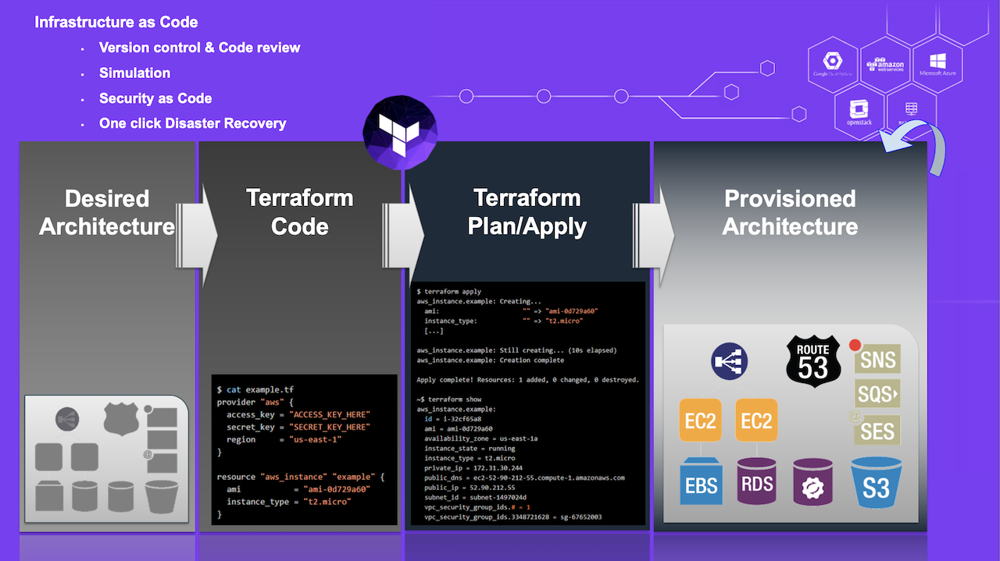
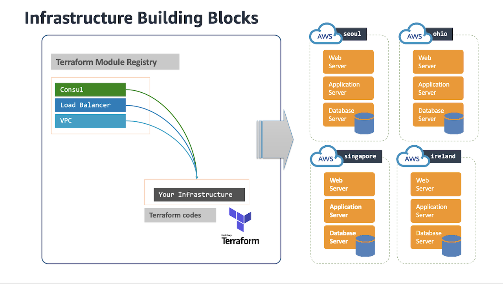

# Terraform
Terraform is an open-source infrastructure as code software tool created by HashiCorp. Users define and provide both cloud and on-premises infrastructure using a declarative configuration language known as HashiCorp Configuration Language (HCL), or optionally JSON. Users can version, reuse, and share these terraform configuration files and also, use a consistent workflow to provision and manage all of their infrastructure throughout its lifecycle.



Terraform supports a number of cloud infrastructure providers such as Amazon Web Services (AWS), Microsoft Azure, IBM Cloud, Serverspace, Google Cloud Platform(GCP), DigitalOcean, Oracle Cloud Infrastructure, Yandex.Cloud, VMware vSphere, and OpenStack. For more details about 'What is Terraform', please visit the HashiCorp [website](https://www.terraform.io/intro#what-is-terraform).

## Terraform Module
Terraform module is a container for multiple resources that are used together. Modules can be used to create lightweight abstractions, so that you can describe your infrastructure in terms of its architecture, rather than directly in terms of physical objects.

In addition to modules from the local filesystem, Terraform can load modules from a public or private registry. HashiCorp launched the Terraform Registry in 2017. This makes it possible to publish modules for others to use, and to use modules that others have published. Initially, it only supported saving and sharing terraform modules. It has now become a general-purpose repository that supports both Providers and Modules. And the name has been changed from Terraform Module Registry to Terraform Registry. The Terraform Registry hosts a broad collection of publicly available Terraform modules for configuring many kinds of common infrastructure. These modules are free to use, and Terraform can download them automatically if you specify the appropriate source and version in a module call block.

Terraform modules can be very powerful building blocks for quickly building a solid infrastructure. Users can build their own infrastructure using Terraform modules in many cloud environments. Below is a conceptual diagram of Terraform-based infrastructure building blocks.



## Terraform Backend on AWS
Users can interact with Terraform providers by declaring resources or by calling data sources. Rather than using imperative commands to provision resources, Terraform uses declarative configuration to describe the desired final state. Once a user invokes Terraform on a given resource, Terraform will perform CRUD actions on the user's behalf to accomplish the desired state. Each Terraform configuration can specify a backend, which defines where and how operations are performed, where [state](https://www.terraform.io/docs/language/state/index.html) snapshots are stored, etc. Backend configuration is only used by Terraform CLI.

There are two areas of Terraform's behavior that are determined by the backend:
+ Where state is stored.
+ Where operations are performed.

## Recommended Backends
+ If you are still learning how to use Terraform, we recommend using the default local backend, which requires no configuration.
+ If you and your team are using Terraform to manage meaningful infrastructure, we recommend using the [remote backend](https://www.terraform.io/docs/language/settings/backends/remote.html).

## Examples
- [Terraform Backend Type: S3](https://github.com/Young-ook/terraform-aws-tfstate/tree/main/examples/backend)

## Getting started
### AWS CLI
Follow the official guide to install and configure profiles.
- [AWS CLI Installation](https://docs.aws.amazon.com/cli/latest/userguide/cli-chap-install.html)
- [AWS CLI Configuration](https://docs.aws.amazon.com/cli/latest/userguide/cli-configure-profiles.html)

### Terraform
Infrastructure Engineering team is using terraform to build and manage infrastucure for DevOps. And we have a plan to migrate cloudformation termplate to terraform.

To install Terraform, find the appropriate package (https://www.terraform.io/downloads.html) for your system and download it. Terraform is packaged as a zip archive and distributed as a single binary. Install Terraform by unzipping it and moving it to a directory included in your system's `PATH`. The [tfenv](https://github.com/tfutils/tfenv) is very useful solution.

And there is an another option for easy install.
```
brew install tfenv
```
You can use this utility to make it ease to install and switch terraform binaries in your workspace like below.
```
tfenv install 0.12.18
tfenv use 0.12.18
```
Also this tool is helpful to upgrade terraform v0.12. It is a major release focused on configuration language improvements and thus includes some changes that you'll need to consider when upgrading. But the version 0.11 and 0.12 are very different. So if some codes are written in older version and others are in 0.12 it would be great for us to have nice tool to support quick switching of version.
```
tfenv list
tfenv use 0.12.18
tfenv use 0.11.14
tfenv install latest
tfenv use 0.12.18
```

# Addtional Resources
- [Terraform Workflow Automation using Atlantis](https://www.runatlantis.io/guide/#getting-started)
